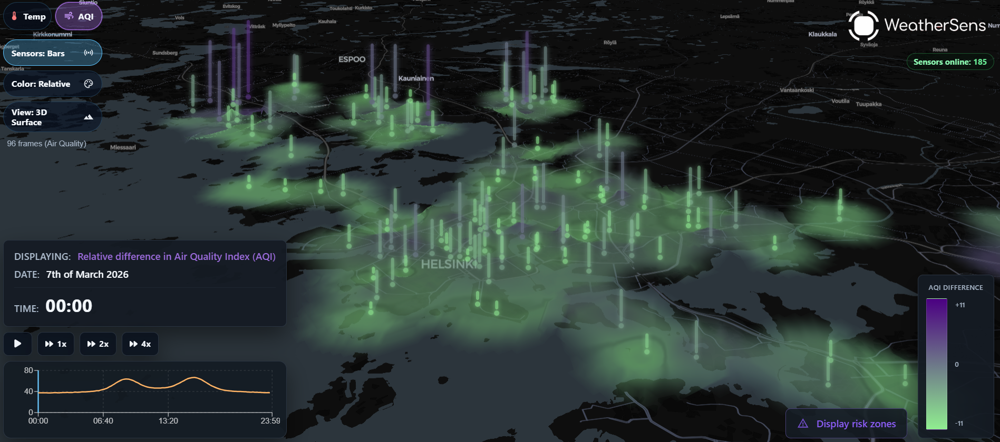

# WeatherSens — Urban Weather Downscaling and Sensor-Aware Environmental Mapping



WeatherSens dashboard preview showing the Helsinki-region map interface, animated 3D sensor bars, relative AQI difference overlay, time controls, and compact monitoring widgets.

WeatherSens is a weather intelligence and environmental sensing project developed during the Port26 hackathon at Aalto University. The project combines sparse sensor observations, coarse meteorological fields, and spatial modelling workflows to produce denser, more locally meaningful weather information for urban environments.

The core motivation is straightforward: city-scale weather varies block by block, but direct observations are sparse and large-scale forecast products are often too coarse to reflect local urban effects. WeatherSens addresses this by combining observational data, interpolation, and machine-learning-based downscaling into a single workflow that supports both analysis and visualization.

## Features

| Component | Description |
| --- | --- |
| Simulation and Inference | Training and inference pipeline for learning local weather residual structure from meteorological source data and station observations |
| Spatial Downscaling | Dense-grid inference over a target domain using coarse weather fields as large-scale context and observations as local correction signals |
| Interpolation API | FastAPI service for sensor access, history queries, and inverse-distance-weighted interpolation outputs |
| Interactive Map Frontend | React and TypeScript frontend for exploring sensors, time series, and gridded weather products in geographic context |
| Plotting and Diagnostics | Validation plots, learning curves, map outputs, and re-plotting workflows for model inspection and presentation |


## Dashboard Preview

The current dashboard presents WeatherSens as a dense, map-based urban weather interface rather than a conventional tabular monitoring tool. The frontend combines a dark geospatial basemap with layered environmental overlays, animated sensor bars, and time-aware controls for exploring spatial differences across the Helsinki region.

The interface shown in the project dashboard includes:

- metric switching between temperature and air quality views
- 3D bar-based sensor visualization over the map surface
- relative color encoding for spatial comparison
- time playback controls for stepping through a full day of frames
- a small temporal trend chart for the selected signal
- live system indicators such as sensor availability and risk-zone display controls

This presentation layer is important to the project: the goal is not only to generate dense estimates, but also to make them interpretable at a glance in a form suitable for demonstration, comparison, and rapid decision support.

## Problem

Urban weather and environmental conditions can change substantially over short distances due to land cover, urban geometry, coastal influence, traffic, and other local factors. However, direct measurements are typically available only at a limited number of points, while numerical weather products often represent conditions at a much coarser resolution.

WeatherSens is built around this gap between what is observed and what is needed. Instead of relying only on direct interpolation or only on coarse forecast products, the project studies a combined approach in which:

- coarse meteorological fields provide large-scale spatial structure
- station and sensor observations anchor the solution in measured local conditions
- residual modelling and inference generate denser near-surface weather estimates
- API and frontend layers make those outputs accessible for interpretation and demonstration

In that sense, WeatherSens is both an engineering prototype and an applied urban climate informatics workflow.

## Architecture

```text
backend/
  FastAPI service for sensors, history, and interpolation endpoints
frontend/
  React + TypeScript map interface for weather and sensor visualization
sim/
  Data fetching, preprocessing, model training, dense inference, and plotting
data/
  Generated inference runs, plots, and derived artifacts
```

## Repository Structure

```text
backend/    FastAPI API, schemas, services, SQL, tests
frontend/   React + TypeScript client application
sim/        Model training, inference, plotting, workflows
data/       Generated inference outputs and model artifacts
```

## Project Context

WeatherSens was created during the Port26 hackathon at Aalto University. The repository reflects that origin: it is a compact, end-to-end prototype that combines research-style modelling work with practical API and frontend layers in a single codebase.

Although it was built in a hackathon setting, the project is structured around a serious methodological question: how can sparse observations and broad-scale meteorological context be combined to estimate urban weather more meaningfully at local scale?

## Team

WeatherSens was developed by a multidisciplinary team during the Port26 hackathon at Aalto University. Together, the team designed the end-to-end prototype, including the urban weather modelling workflow, backend API, and interactive map-based frontend.

Atte Laakso · Nikolas Juhava · Aarni Nordström · Manu Mäkinen · Qilun Li

## Quick Start

### Backend

```powershell
cd backend
uv sync
uv run uvicorn main:app --reload
```

Before using the backend with a real database, run the SQL files in `backend/sql/` and configure the required environment variables.

### Frontend

```powershell
cd frontend
npm install
npm run dev
```

### Simulation Pipeline

```powershell
cd sim
uv sync
uv run python -m sim.workflows.fetch_data --config project.toml
uv run python -m sim.workflows.train_model --config project.toml
```

Optional inference workflows:

```powershell
uv run python -m sim.workflows.run_inference_request --config project.toml
uv run python -m sim.workflows.run_ifs_snapshot --config project.toml
```

## Typical Outputs

WeatherSens produces several kinds of outputs, depending on the workflow being run:

- interpolated sensor grids served through the backend API
- trained model artifacts and validation plots under `sim/models/runs/`
- dense inference outputs and generated maps under `data/inference_runs/`
- live snapshot comparison plots for quick current-condition demonstrations

The path `sim/port26_sim.egg-info/` is legacy packaging metadata from an earlier internal package name and should be treated as generated output rather than edited source.

## Documentation

- `backend/README.md` for backend setup and endpoint details
- `frontend/README.md` for frontend structure and local development
- `sim/README.md` for the simulation pipeline quick reference
- `sim/USAGE.md` for detailed modelling and inference usage
- `sim/PLOTTING.md` for map and plotting commands

## References

The conceptual framing of WeatherSens is informed by literature on physics-informed machine learning, Earth system modelling, and statistical downscaling. The following BibTeX entries are included here for reference.

```bibtex
@article{raissi2019physics,
  title={Physics-informed neural networks: A deep learning framework for solving forward and inverse problems involving nonlinear partial differential equations},
  author={Raissi, Maziar and Perdikaris, Paris and Karniadakis, George E},
  journal={Journal of Computational Physics},
  volume={378},
  pages={686--707},
  year={2019},
  publisher={Elsevier},
  doi={10.1016/j.jcp.2018.10.045}
}

@article{reichstein2019deep,
  title={Deep learning and process understanding for data-driven Earth system science},
  author={Reichstein, Markus and Camps-Valls, Gustau and Stevens, Bjorn and Jung, Martin and Denzler, Joachim and Carvalhais, Nuno and Prabhat},
  journal={Nature},
  volume={566},
  number={7743},
  pages={195--204},
  year={2019},
  publisher={Nature Publishing Group UK London},
  doi={10.1038/s41586-019-0912-1}
}

@article{kashinath2021physics,
  title={Physics-informed machine learning for weather and climate modelling},
  author={Kashinath, Karthik and Mustafa, Mustafa and Albert, Adrian and Wu, Jiulin and Jiang, Chiyu and Esmaeilzadeh, Soheil and Azizzadenesheli, Kamyar and Wang, Rui and Chattopadhyay, Ashesh and Singh, Amit and others},
  journal={Philosophical Transactions of the Royal Society A},
  volume={379},
  number={2194},
  pages={20200093},
  year={2021},
  publisher={The Royal Society},
  doi={10.1098/rsta.2020.0093}
}

@inproceedings{vandal2017deepsd,
  title={DeepSD: Generating high resolution climate change projections through single image super-resolution},
  author={Vandal, Thomas and Dai, Evan and Dy, Jennifer and Ganguly, Auroop R and Ness, Amina and Kumar, Vipin},
  booktitle={Proceedings of the 23rd ACM SIGKDD International Conference on Knowledge Discovery and Data Mining},
  pages={1663--1672},
  year={2017},
  doi={10.1145/3097983.3098004}
}

@article{liston2006meteorological,
  title={A meteorological distribution system for high-resolution terrestrial modeling (MicroMet)},
  author={Liston, Glen E and Elder, Kelly},
  journal={Journal of Hydrometeorology},
  volume={7},
  number={2},
  pages={217--234},
  year={2006},
  publisher={American Meteorological Society},
  doi={10.1175/JHM486.1}
}
```

## License

This repository uses split licensing:

- everything outside `sim/` is proprietary and all rights are reserved under `LICENSE`
- `sim/` is licensed separately under the MIT License in `sim/LICENSE`